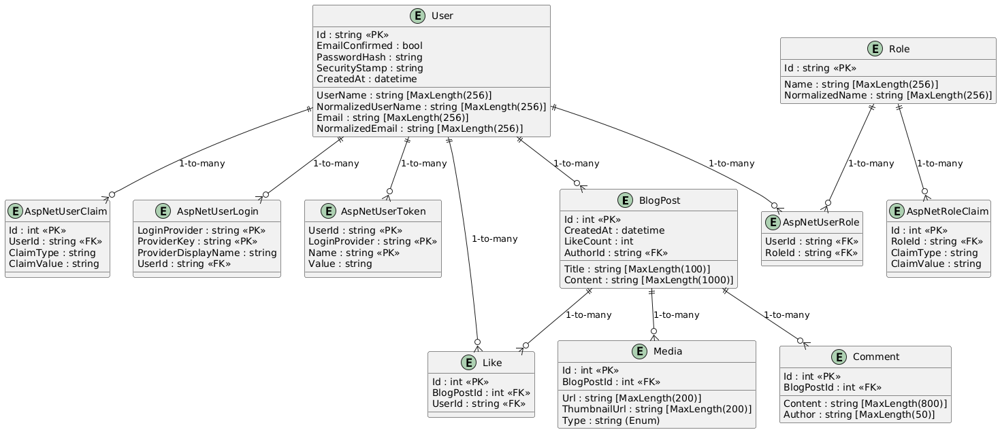

# 🏆 Blazor 2D Maze Game

## 📌 Project Overview
The **Blazor 2D Maze Game** is an interactive, top-down **maze generation and solving project** designed to demonstrate **data structures and algorithms** in a fun and engaging way. This project is part of a **Data Structures course**, focusing on **graph traversal, pathfinding, and visibility algorithms**.

### 🎯 **Core Features**
- **Maze Generation & Solving Algorithms** 🏗️
- **Fog-of-War & Dynamic Lighting** 🔦
- **Interactive Gameplay with Items & Traps** 🧩
- **Minimap Updates Based on Exploration** 🗺️
- **Multiple Levels of Increasing Complexity** 📈
- **Optimized Data Structures for Performance** 🚀

---

## 🛠️ **Technical Stack**
- **Frontend**: Blazor WebAssembly (for real-time rendering)
- **Canvas Rendering**: Blazor.Extensions.Canvas / SkiaSharp
- **Backend (Optional)**: ASP.NET Core (for saving progress or leaderboards)
- **Data Storage**: LocalStorage or IndexedDB


---

## 📌 **Maze Generation Approaches**
The game generates procedural mazes using one of the following approaches:

### **1️⃣ Recursive Backtracking (Depth-First Search)**
- **Algorithm Type**: DFS-based
- **Best for**: Generating perfect mazes with a clear solution.
- **Approach**:
  1. Start at a random cell.
  2. Mark it as visited and push it onto a stack.
  3. Randomly select an unvisited neighbor, remove the wall, and move to that cell.
  4. If no unvisited neighbors, backtrack using the stack.
  5. Continue until all cells are visited.

```csharp
void GenerateMazeDFS(int x, int y)
{
    maze[x, y] = TileType.Floor;
    visited[x, y] = true;

    foreach (var (dx, dy) in RandomizedDirections())
    {
        int nx = x + dx * 2, ny = y + dy * 2;
        if (IsWithinBounds(nx, ny) && !visited[nx, ny])
        {
            maze[x + dx, y + dy] = TileType.Floor; // Remove wall
            GenerateMazeDFS(nx, ny);
        }
    }
}
```

📌 **Data Structure Used**:
- `Stack<(int, int)>` (for backtracking)
- `bool[,] visited` (tracks visited cells)

---

### **2️⃣ Prim’s Algorithm (Randomized)**
- **Algorithm Type**: Minimum spanning tree-based
- **Best for**: Natural-looking mazes with more open space.
- **Approach**:
  1. Start with a grid of walls.
  2. Choose a random starting point and mark it as a floor tile.
  3. Add all adjacent walls to a list.
  4. While walls exist in the list:
     - Choose a random wall and check if it separates a visited and unvisited cell.
     - If yes, remove the wall and mark the adjacent cell as visited.
     - Add the new walls of that cell to the list.

```csharp
void GenerateMazePrims()
{
    List<(int, int)> walls = new();
    maze[1, 1] = TileType.Floor;
    AddWalls(1, 1, walls);

    while (walls.Count > 0)
    {
        var (x, y) = walls.RemoveRandom();
        if (CanCarve(x, y))
        {
            maze[x, y] = TileType.Floor;
            MarkVisitedAndAddWalls(x, y, walls);
        }
    }
}
```

📌 **Data Structure Used**:
- `List<(int, int)>` (for wall storage)
- `HashSet<(int, int)>` (to track visited cells)

---

### **3️⃣ Kruskal’s Algorithm (Union-Find)**
- **Algorithm Type**: Randomized spanning tree
- **Best for**: Fully connected mazes with guaranteed paths.
- **Approach**:
  1. Treat each cell as its own set.
  2. Randomly select walls and check if they separate two distinct sets.
  3. If they do, remove the wall and merge the sets.
  4. Continue until all cells are connected.

📌 **Data Structure Used**:
- **Disjoint Set Union (DSU)**
- `Dictionary<(int, int), int>` (for cell-set mapping)

---

## 📌 **Maze Solving Algorithms**
Once a maze is generated, the player or an AI solver can find the shortest path using different strategies:

### **1️⃣ Breadth-First Search (BFS)**
- **Algorithm Type**: Unweighted graph traversal
- **Best for**: **Finding the shortest path** in a uniform-cost maze.
- **Approach**:
  1. Start from the player's position.
  2. Use a queue to explore neighbors in all directions.
  3. Keep track of visited nodes to prevent revisiting.
  4. Stop when the exit is reached.

```csharp
Queue<(int, int)> queue = new();
Dictionary<(int, int), (int, int)> parent = new();
queue.Enqueue(start);
parent[start] = (-1, -1);

while (queue.Count > 0)
{
    var (x, y) = queue.Dequeue();
    if ((x, y) == exit) break;

    foreach (var (dx, dy) in Directions)
    {
        int nx = x + dx, ny = y + dy;
        if (IsWalkable(nx, ny) && !parent.ContainsKey((nx, ny)))
        {
            queue.Enqueue((nx, ny));
            parent[(nx, ny)] = (x, y);
        }
    }
}
```

📌 **Data Structure Used**:
- `Queue<(int, int)>` (for BFS traversal)
- `Dictionary<(int, int), (int, int)>` (for backtracking the solution)

---

### **2️⃣ A* (A-Star) Algorithm**
- **Algorithm Type**: Heuristic-based pathfinding
- **Best for**: **Optimized shortest path with heuristics**
- **Approach**:
  1. Assign a **cost function**: `f(n) = g(n) + h(n)`
     - `g(n)`: Cost from start to `n`
     - `h(n)`: Estimated cost from `n` to goal (heuristic)
  2. Use a **priority queue** to explore the lowest-cost path first.
  3. Expand the best candidate and update its neighbors.

```csharp
PriorityQueue<(int, int), int> openSet = new();
Dictionary<(int, int), int> gScore = new();
openSet.Enqueue(start, 0);
gScore[start] = 0;

while (openSet.Count > 0)
{
    var (x, y) = openSet.Dequeue();
    if ((x, y) == exit) break;

    foreach (var (dx, dy) in Directions)
    {
        int nx = x + dx, ny = y + dy;
        int newG = gScore[(x, y)] + 1;
        if (newG < gScore.GetValueOrDefault((nx, ny), int.MaxValue))
        {
            gScore[(nx, ny)] = newG;
            int fScore = newG + ManhattanDistance(nx, ny, exit);
            openSet.Enqueue((nx, ny), fScore);
        }
    }
}
```

📌 **Data Structure Used**:
- `PriorityQueue<(int, int), int>` (for sorting nodes by cost)
- `Dictionary<(int, int), int>` (for tracking scores)

---

### **3️⃣ Dijkstra’s Algorithm**
- **Algorithm Type**: Weighted shortest path
- **Best for**: **Handling weighted movement costs**
- **Approach**:
  1. Initialize distances with `∞`, except for the start node (`0`).
  2. Use a **priority queue** to process nodes in increasing order of cost.
  3. Update distances and track parents for path reconstruction.

📌 **Data Structure Used**:
- `PriorityQueue<(int, int), int>`
- `Dictionary<(int, int), int>`

---

### **3️⃣ Multi-Layer Tile System**
To optimize performance and maintain clarity, the game uses **two separate 2D arrays**:

#### **Maze Grid (TileType[,] maze)**
- Represents the **static** structure of the maze
- Each tile is either a **wall (0)** or **walkable floor (1)**

#### **Object Layer (ObjectType[,] objectLayer)**
- Tracks **interactive elements** separately (e.g., traps, potions, keys)
- Object Types: `Trap`, `Potion`, `Key`, `Compass`, `Scroll`, `Exit`

📌 **Data Structure Used**:
- `enum TileType { Wall, Floor }`
- `enum ObjectType { Trap, Potion, Key, Exit, None }`

---

### **4️⃣ Fog of War Algorithm**
The **fog of war** dynamically updates based on the player’s **vision radius**.

#### **Grid Storage for Visibility**
- `bool[,] exploredTiles` → Tiles that have been seen at least once
- `bool[,] visibleTiles` → Tiles currently visible in the player’s radius
- `int visibilityRadius = 3` (adjustable with power-ups)

#### **Updating Visibility**
```csharp
void UpdateVisibility(int playerX, int playerY)
{
    Array.Clear(visibleTiles, 0, visibleTiles.Length);
    
    for (int dx = -visibilityRadius; dx <= visibilityRadius; dx++)
    {
        for (int dy = -visibilityRadius; dy <= visibilityRadius; dy++)
        {
            int nx = playerX + dx;
            int ny = playerY + dy;
            if (IsWithinBounds(nx, ny) && maze[nx, ny] != TileType.Wall)
            {
                visibleTiles[nx, ny] = true;
                exploredTiles[nx, ny] = true;
            }
        }
    }
}
```

#### **Rendering Logic**
```csharp
for (int x = 0; x < width; x++)
{
    for (int y = 0; y < height; y++)
    {
        if (visibleTiles[x, y])
            DrawTile(x, y); // Fully render
        else if (exploredTiles[x, y])
            DrawTileFaded(x, y); // Render with reduced opacity
        else
            DrawDarkness(x, y); // Render as black
    }
}
```

📌 **Data Structure Used**:
- `bool[,] exploredTiles`
- `bool[,] visibleTiles`
- `int visibilityRadius`

---

## 📌 **Performance Optimizations**
✅ **Pre-filter valid floor tiles** for object placement  
✅ **Use direct 2D array lookups (O(1))** for efficient tile interactions  
✅ **Lazy updates** to the minimap instead of redrawing every frame  
✅ **Separate rendering layers** for maze walls, objects, and player  
✅ **Optimize visibility updates** by only processing tiles in the fog-of-war radius  

---

## 📅 **Development Roadmap**
### **Phase 1: Core Mechanics**
✅ Implement maze generation & solving algorithms  
✅ Create **player movement** with dynamic **fog-of-war**  
✅ Develop **trap placement & disarm mechanics**  
✅ Add **basic minimap functionality**  

### **Phase 2: Gameplay Features**
🚀 Implement **inventory system** (tools, potions, compass, scrolls)  
🚀 Add **item interactions** (picking up & using items)  
🚀 Introduce **health mechanics & trap damage**  
🚀 Develop **multiple levels** with increasing complexity  

### **Phase 3: UI and Polish**
🎨 **Main Menu, Pause Menu, Game Over Screen**  
🎨 **Animations** for player movement, traps triggering, & item collection  
🎨 **Refine minimap visuals** & add real-time player position marker  
🎨 **Balance gameplay difficulty**  

### **Phase 4: Testing and Deployment**
🛠️ Test all levels to ensure fairness & solvability  
🛠️ Optimize performance for **smooth gameplay**  
🛠️ Deploy as a **Blazor WebAssembly** app  

---

## 🎮 **How to Play**
- **Move through the maze**, avoid traps, and collect power-ups
- **Use potions & items** to increase your visibility and stats
- **Find the exit** and complete the level before the timer runs out!

---


# Website Section

## Overview
MazeGameBlazor is a Blazor-based web application that includes user authentication, blog management, and various services. This repository contains the source code and documentation for the project.

## Features
- User authentication and role-based access control
- Blog post creation, comments, and likes
- API endpoints for handling data operations
- Structured documentation for easy reference

---

## 📂 Documentation Reference

### 📌 API
- [API Endpoints](docs/api/API_Endpoints.md)

### 🛠️ Contributing
- [Code Style Guide](docs/contributing/CodeStyle.md)
- [Contribution Guide](docs/contributing/Contribution.md)

### 📡 Controllers
- [Media Controller](docs/controllers/MediaController.md)

### 🗄️ Database
- [AppDbContext](docs/database/AppDbContext.md)
- [BlogPost](docs/database/BlogPost.md)
- [Comment](docs/database/Comment.md)
- [Like](docs/database/Like.md)
- [Media](docs/database/Media.md)
- [Migrations](docs/database/Migrations.md)
- [Role](docs/database/Role.md)
- [User](docs/database/User.md)

### 🏗️ Entity Relationship Diagram (ERD)
- 
- [ERD Source File](docs/db/erd.puml)

### 🚀 Deployment
- [Docker Setup](docs/deployment/Docker.md)
- [Hosting Guide](docs/deployment/Hosting.md)

### 🎨 Frontend
- [Layout](docs/frontend/Layout.md)
- [Pages](docs/frontend/Pages.md)
- [Routing](docs/frontend/Routing.md)
- [StandAlone Components](docs/frontend/StandAloneComponents.md)

### 🔑 Identity
- [Identity Overview](docs/identity/IdentityOverview.md)
- [Role-Based Access Control](docs/identity/RoleBasedAccess.md)

### 🔐 Security
- [Authentication](docs/security/Authentication.md)
- [Authorization](docs/security/Authorization.md)

### 🏗️ Services
- [Auth Service](docs/services/AuthService.md)
- [Blog Service](docs/services/BlogService.md)

### ⚙️ Setup
- [Configuration](docs/setup/Configuration.md)
- [Installation Guide](docs/setup/Installation.md)

---

## 🔧 Getting Started

### Prerequisites
- .NET 9.0
- MSSQL Server
- Docker (for containerized setup)
- Blazor WebAssembly

### Installation
```sh
git clone https://github.com/your-repo/MazeGameBlazor.git
cd MazeGameBlazor
dotnet build
dotnet run
```

### Running with Docker
```sh
docker-compose up -d
```

---

## 📜 License
This project follows the standard licensing agreement defined for MazeGameBlazor.

---

## 📬 Contact
For questions or contributions, open an issue or reach out via [GitHub](https://github.com/your-repo).
